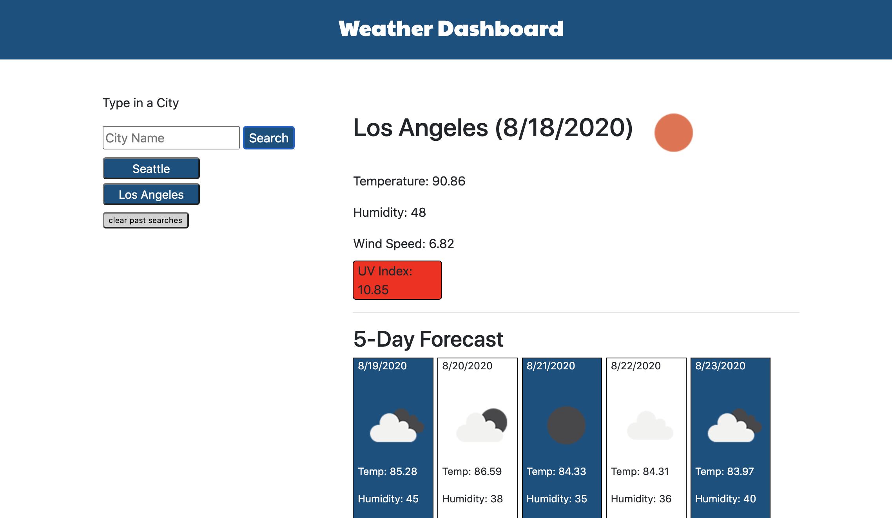

# Weather Dashboard

## Description

Weather DashBoard is a responsive web application for looking up the weather in a specifi city. A user will type in their city and then the browser will display current and future weather conditions for that city.

## Table of Contents

* [Description](#description)
* [Technology](#technology)
* [User Story](#user-story)
* [Installation](#installation)
* [Usage](#usage)
* [License](#license)
* [Contributing](#contributing)
* [Tests](#tests)
* [Questions](#questions)
* [Deployed Application URL](#deployed-application-URL)

## Technology

- HTML
- Bootstrap
- CSS
- JavaScript
- jQuery
- AJAX
- Open Weather Map API

## User Story

AS A traveler, I WANT to see the weather outlook for multiple cities SO THAT i can plan a trip accordingly.

## Installation

There are no installation steps. Just begin by loading the browser and typing in a city or click on a saved city.

## Usage

The deployed application link will take you to the homepage. To start, type in a city name in the text input area. Click on search to display the current weather conditions for that city. Below the current weather display will show the 5 day weather forecast.

## License

## Contributing

Please follow standard contributing guidelines

## Tests

No tests to run

## Questions

For any questions, please contact kendayao at kendayao@gmail.com

## Deployed Application URL

Deployed Application Link: https://kendayao.github.io/Weather-Dashboard/

Video Demo Link: https://giphy.com/gifs/Y1BNVnPrqsDYarU6pM/fullscreen

